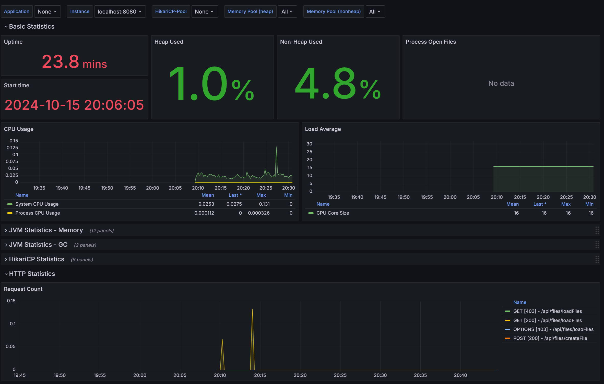
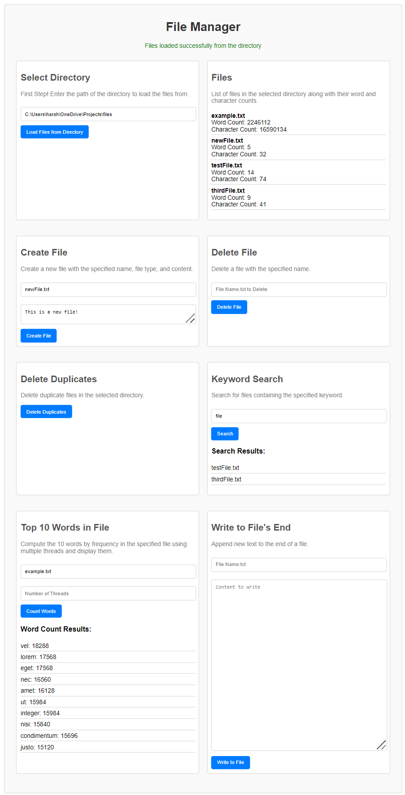

# File Manager

FileManager is a file management application developed with a Spring Boot backend and React frontend. It provides functionalities to load files from a directory, create files, delete files, delete duplicate files, search for keywords within files, and display a file's top 10 frequent words using multithreading.
Additionally, Grafana and Prometheus setup to help monitor and analyze this project as you use it locally is optionally included below.

View the frontend here: https://filemanagerapp.harshaanc.dev/. The deployment of the backend is still in the works, as it would necessitate cloud storage due to the nature of the application.
At this time you will need to follow the steps outlined below to modify files on your local machine.

## Features

- **Load Files**: Load text files from a specified directory and display their word and character counts.
- **Create File**: Create a new file with specified content in the directory.
- **Write to File**: Append content to an existing file.
- **Delete File**: Delete a specified file from the directory.
- **Delete Duplicates**: Delete duplicate files based on their content.
- **Keyword Search**: Search for files containing a specified keyword.
- **Display Top 10 Words**: Rapidly computes and displays the top 10 frequently appearing words in a specified file using a multithreaded approach. Allows user to select thread count.

## Prerequisites

- Java 21 (11 or higher should work)
- Node.js and npm
- Maven

## Getting Started
The File Manager Application is configured to be run locally for security and ease of use.
### Backend Setup

1. **Clone the repository**:
    ```sh
    git clone https://github.com/Harshaan-Chugh/FileManagerApp.git
    cd FileManagerFS
    ```

2. **Build the project**:
    ```sh
    mvn clean install
    ```

3. **Run the Spring Boot application**:
    ```sh
    mvn spring-boot:run
    ```

### Frontend Setup

1. **Navigate to the root directory**:
    ```sh
    cd frontend
    ```

2. **Install the dependencies**:
    ```sh
    npm install
    npm install cross-env 
    ```

3. **Start the React application**:
    ```sh
    npm start
    ```

### API Endpoints
Use these API Endpoints for testing in Postman or to better understand the functionality of the program. 
- **Load Files**
    - URL: `/api/files/loadFiles`
    - Method: `GET`
    - Query Parameters: `directoryPath` (string)
    - Response: List of file details including file name, word count, and character count

- **Create File**
    - URL: `/api/files/createFile`
    - Method: `POST`
    - Query Parameters: `fileName` (string), `fileContent` (string)
    - Response: Success or error message

- **Write File**
    - URL: `/api/files/writeFile`
    - Method: `POST`
    - Query Parameters: `fileName` (string), `fileContent` (string)
    - Response: Success or error message

- **Delete File**
    - URL: `/api/files/deleteFile`
    - Method: `DELETE`
    - Query Parameters: `fileName` (string)
    - Response: Success or error message

- **Delete Duplicates**
    - URL: `/api/files/deleteDuplicates`
    - Method: `DELETE`
    - Response: Success or error message

- **Keyword Search**
    - URL: `/api/files/keywordSearch`
    - Method: `GET`
    - Query Parameters: `keyword` (string)
    - Response: List of file names containing the keyword

- **Count Words**
    - URL: `/api/files/countWords`
    - Method: `GET`
    - Query Parameters: `fileName` (string), `numThreads` (int)
    - Response: List of word counts

## Project Structure

### Backend Classes

- **EditableFile**: Represents an editable file with functionalities to read, write, and count words and characters.
- **FileManager**: Manages a list of `EditableFile` instances.
- **FileManagerController**: REST controller for managing file operations.
- **FileManagerService**: Service for managing files in a specified directory.
- **MultithreadedWordCounter**: Multithreaded word counter that counts words in a file using a specified number of threads.
- **WordCounterService**: Service for the word counting operation.
- **WebConfig** Allows for Cross-Origin Resource Sharing (CORS) to enable communication with the React frontend, since they have different origins.
- **FileManagerApplication**: Main application class for the FileManager application.

### Frontend

- **FileManager**: Main React component that provides the user interface for managing files.
- **FileManagerService**: Contains functions to make API calls to the backend.

## Monitoring with Prometheus and Grafana
This project is monitored using **Prometheus** to collect metrics and **Grafana** to visualize them.

### Step 1: Set up Prometheus

1. **Download Prometheus**:
  - Go to the [Prometheus download page](https://prometheus.io/download/) and download the appropriate binary for your OS.
  - Extract the downloaded files into a directory (e.g., `C:\Prometheus`).

2. **Create `prometheus.yml` configuration file**:  
   In the Prometheus root directory (where `prometheus.exe` resides), create or edit the `prometheus.yml` file to define the configuration for scraping the Spring Boot metrics.

   ```yaml
   global:
     scrape_interval: 5s  # Set the scrape interval
   scrape_configs:
     - job_name: 'file-manager-app'
       metrics_path: '/actuator/prometheus'  # Path to Spring Boot metrics
       static_configs:
         - targets: ['localhost:8080']
     - job_name: 'prometheus'
       static_configs:
         - targets: ['localhost:9090']

#### Verify Prometheus is running:

- Visit [http://localhost:9090](http://localhost:9090) in your browser.
- You can run queries on your metrics by using the Prometheus expression browser.

### Step 2: Enable Spring Boot Actuator Prometheus Metrics

#### Add the Spring Boot Actuator dependency:

Ensure your `pom.xml` includes the following dependencies:

```xml
<dependency>
    <groupId>org.springframework.boot</groupId>
    <artifactId>spring-boot-starter-actuator</artifactId>
</dependency>
```
```xml
<dependency>
    <groupId>io.micrometer</groupId>
    <artifactId>micrometer-registry-prometheus</artifactId>
</dependency>
```

#### Enable Prometheus metrics in `application.properties`:

Add the following to your `src/main/resources/application.properties` file:

```properties
management.endpoints.web.exposure.include=*
management.endpoint.prometheus.enabled=true
management.metrics.export.prometheus.enabled=true
```

#### Run your Spring Boot application:

The Spring Boot application will expose metrics at [http://localhost:8080/actuator/prometheus](http://localhost:8080/actuator/prometheus). Prometheus will scrape these metrics.

### Step 3: Set up Grafana

#### Download and install Grafana:

- Go to the [Grafana download page](https://grafana.com/grafana/download) and download the appropriate version for your system.
- Install and run Grafana by navigating to the installation directory and running the Grafana executable.

#### Login to Grafana:

- Grafana will be available at [http://localhost:3000](http://localhost:3000).
- Default credentials are:
  - **Username**: `admin`
  - **Password**: `admin`

#### Add Prometheus as a data source:

1. In the Grafana dashboard, click the **gear icon** (Configuration) and select **Data Sources**.
2. Click **Add Data Source**.
3. Choose **Prometheus** from the list.
4. In the **URL** field, enter `http://localhost:9090`.
5. Click **Save & Test** to confirm the connection.

#### Import a Grafana Dashboard:

You can either create a custom dashboard or use a prebuilt one:

1. Click **+** (Create) -> **Import**.
2. Enter **Dashboard ID**: `10280` (Spring Boot 2.1 Statistics) and click **Load**.
3. Select your Prometheus data source and click **Import**.

You will now see real-time metrics from your Spring Boot application visualized in Grafana.

### Step 4: Viewing Metrics in Grafana

Once Prometheus is scraping the metrics from your Spring Boot application and Grafana is set up, you can monitor JVM statistics, CPU usage, memory usage, and much more.

- **Spring Boot JVM Metrics**: You can monitor JVM heap memory, CPU usage, garbage collection stats, thread count, and more.
- **Custom Metrics**: If you have custom application-specific metrics, they will also be available on the `/actuator/prometheus` endpoint and visualized in Grafana.

### Example


## Contributing

Please fork the repository and submit a pull request.

## License

This project is licensed under the MIT License.

-----------------------------------------------
Note: Number of threads used was intentionally backspaced for clarity via placeholder text. For less grainy sample see the static site where you can get a feel for the UI before setting the project up yourself.

